# springboot035-基于SpringBoot的学科竞赛管理系统

>  博主介绍：
>  Hey，我是程序员Chaers，一个专注于计算机领域的程序员
>  十年大厂程序员全栈开发‍ 日常分享项目经验 解决技术难题与技术推荐 承接各类网站设计，小程序开发，毕设等。
>  【计算机专业课程设计，毕业设计项目，Java，微信小程序，安卓APP都可以做，不仅仅是计算机专业，其它专业都可以】

## 3000套系统可挑选，获取链接：https://chaerspol.github.io/

<b>QQ【获取完整源码】：674456564</b>

<b>QQ群【获取完整源码】：1058861570</b>

### 系统架构

> 前端：html | js | css | jquery | vue
>
> 后端：springboot | mybatis
> 
> 环境：jdk1.8+ | mysql | maven

# 一、内容包括
包括有  项目源码+项目论文+数据库源码+答辩ppt+远程调试成功

# 二、运行环境

> jdk版本：1.8 及以上； ide工具：IDEA； 数据库: mysql5.7及以上；编程语言: Java

# 三、需求分析

**3.1可行性分析**

在进行可行性分析时，我们通常根据软件工程里方法，通过四个方面来进行分析，分别是技术、经济、操作和法律可行性。因此，在基于对目标系统的基本调查和研究后，对提出的基本方案进行可行性分析。

**3.1.1技术可行性**

本学科竞赛管理系统的设计与实现采用Java技术和MYSQL数据库进行开发设计，作为计算机专业学生，在学校期间就接触到许多关于编程方面的知识，当然也包括各种编程软件，对他们的了解度也比较系统，所以技术开发上面还是有一定把握。

**3.1.2操作可行性**

本系统操作页面简洁明了，操作极其容易，用户登陆后一眼便可看到自己所需要的信息，而管理员的操作也十分轻松便捷，只要操作人员具有一定的文字水平以及简单的逻辑思维，就可以轻松操作本系统，因此本系统在操作上是可行的。

**3.1.3经济可行性**

该系统的开发工具使用的都是免费的开发工具，且内容较为简单，一台计算机便可以开发出这个系统，且后期的维护，修改等对本系统的改动，都可以只通过一台计算机实现，因此开发该系统的成本在有计算机的情况下基本为0，所以本系统在经济上是可行的。

**3.1.4法律可行性**

本学科竞赛管理系统的设计与实现开发的所有技术资料都为合法，知识产权问题不会发生在开发过程中，而且没有抄袭其他相关系统，不会有侵犯版权的问题。所以在开发过程中不会涉及法律责任。
通过以上可行性分析得知，可以利用现有的技术和合理的成本开发出本网站，并且能够在遵守相关法律的基础上运行该系统。

**3.2系统性能分析**

（1）完整性分析

要求各种信息记录的完整性，内容不能为空，各种数据间联系应保持正确性，且相同的数据在不同记录中的一致性。

（2）系统运行速度分析

页面响应时问应该在3秒以内，最长不能超过4秒。

（3）界面分析

系统界面要求简单明了，容易操作，符合用户操作习惯。

（4）安全性分析

要充分保证系统的安全性、稳定性。要想对系统进行管理，必须经过正确的账号密码进行登录，否则无权进行管理。在具体实现中对不同的权限进行设定，不同权限的用户在系统中登陆后，不可以越级操作。

**3.3系统功能分析**

此学科竞赛管理系统的设计与实现功能分析主要分为管理员功能模块和学生功能模块两大模块，下面详细介绍这两大模块的主要功能：

（1）管理员：管理员登陆后可对系统进行全面管理，管理员主要功能模块包括个人中心、学生管理、教师管理、赛项信息管理、赛项报名管理、奖项统计管理、管理员管理以及系统管理，管理员实现了对系统信息的查看、添加、修改和删除的功能。管理员用例图如图所示。
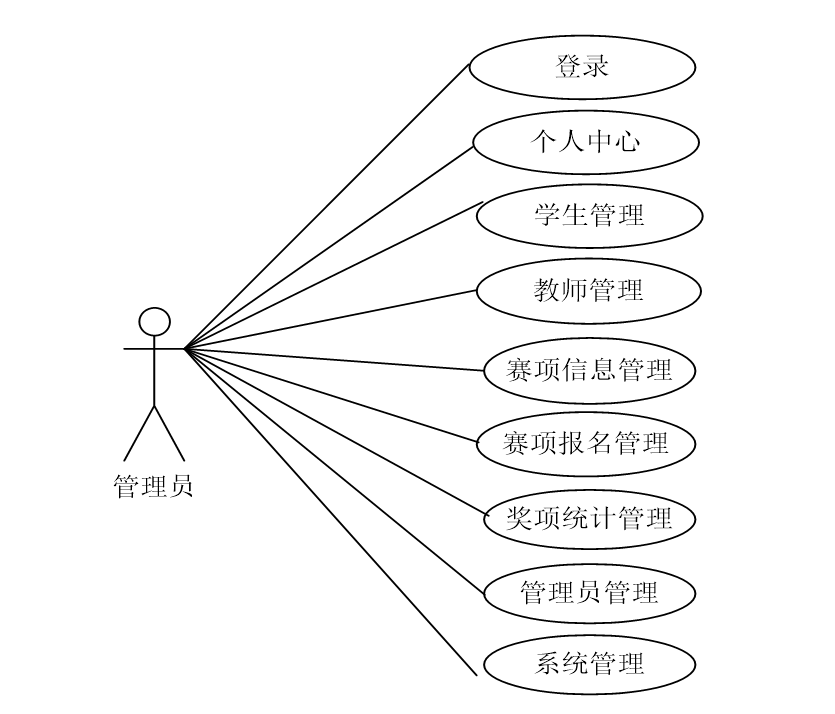

（2）学生：学生进入本学科竞赛管理系统的设计与实现前台可查看系统信息，包括首页、赛项信息以及新闻资讯等，注册登录后主要功能模块包括个人中心和赛项报名管理。

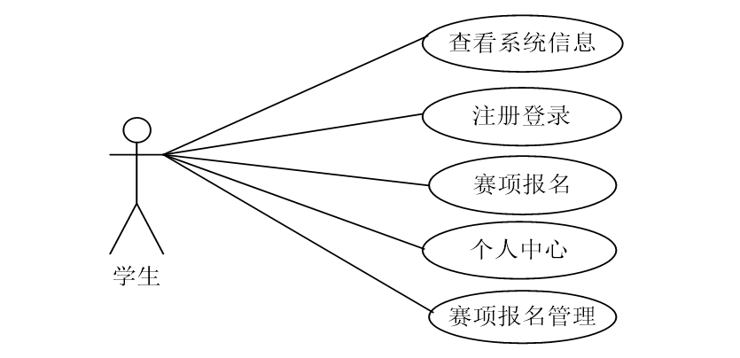

**3.4系统流程分析**

未有账号的学生可进行注册操作，在注册时系统首先判断账号是否存在，存在则提示账号已存在，不存在则判断输入的信息是否合法，合法则在数据库添加注册信息，注册成功，反之注册失败，注册流程如图
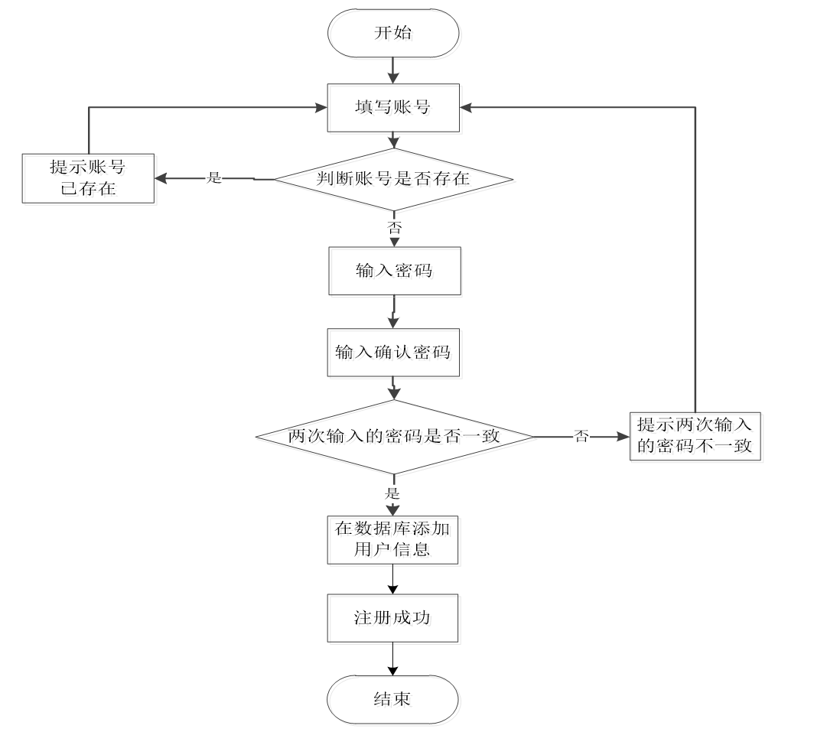

# 四、功能模块

系统架构的整体设计是一个将一个庞大的任务细分为多个小的任务的过程，这些小的任务分段完成后，组合在一起形成一个完整的任务。本学科竞赛管理系统的设计与实现主要包括学生功能模块和管理员功能模块两大部分，系统结构设计如图
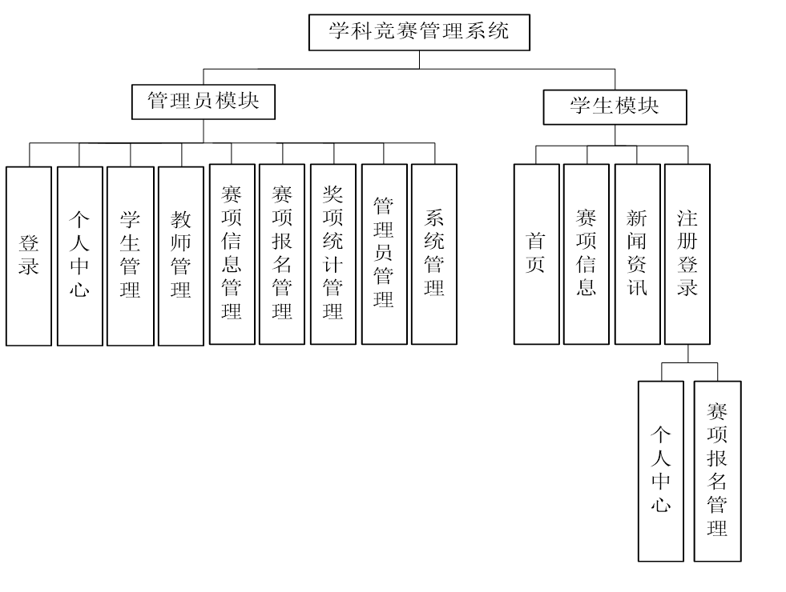

# 五、部分效果图展示

图5-1系统主界面图【学生进入本系统可查看系统信息，系统主界面展示如图】

图5-2 学生注册界面图【没有账号的学生用户可进行注册操作，学生注册界面展示如图】
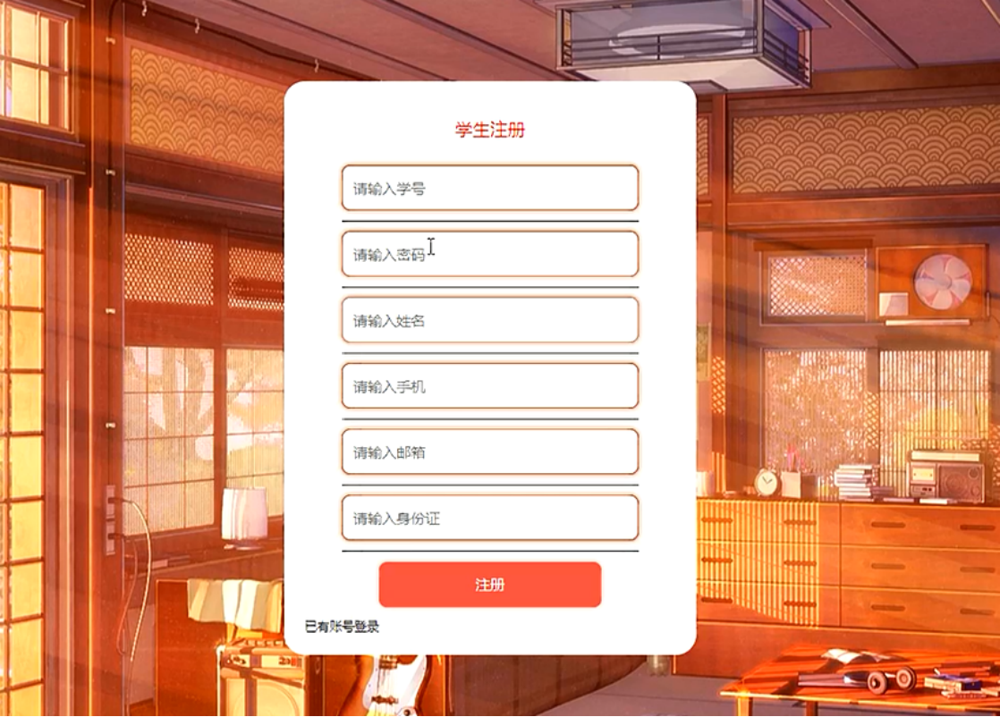

图5-3 学生登录界面图【学生在登录时需输入正确的登录用户名和密码，系统会以登录用户名、密码为参数进行登录信息的验证，信息正确则登录成功，反之登录失败，学生登录界面展示如图】
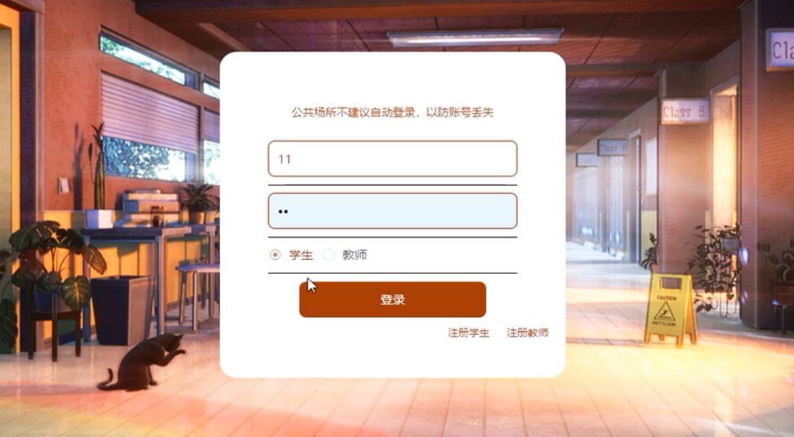

图5-4 赛项详情界面图【学生可选择赛项查看详情信息，登录后可进行报名操作，赛项详情界面展示如图】
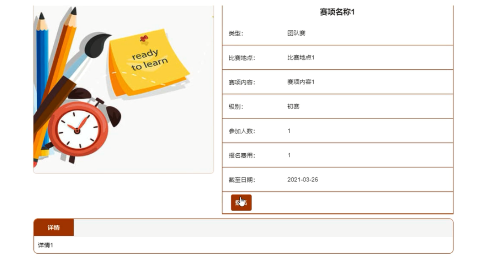

图5-5  报名界面图【报名界面展示如图】
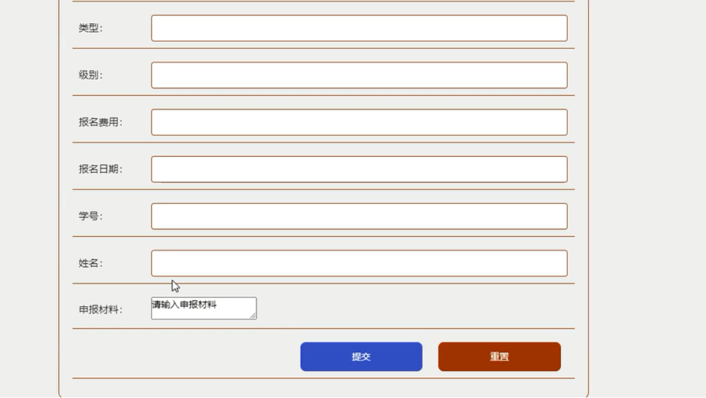

图5-6  个人中心界面图【学生可对个人信息进行修改，个人中心界面展示如图】
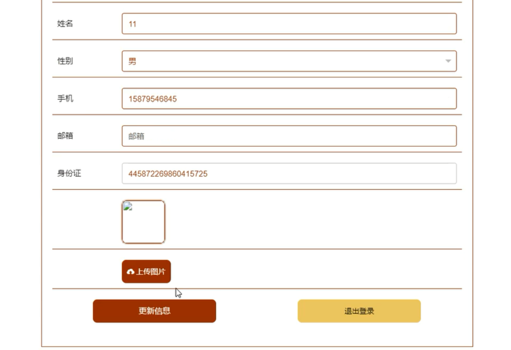

图5-7 管理员登录界面图【管理员要想进入后台进行管理操作，必须登录系统后台，管理员登录界面展示如图】

图5-8 学生管理界面图【管理在学生管理界面可查看所有学生信息，并可对其进行修改和删除操作，同时也可添加学生信息，学生管理界面展示如图】
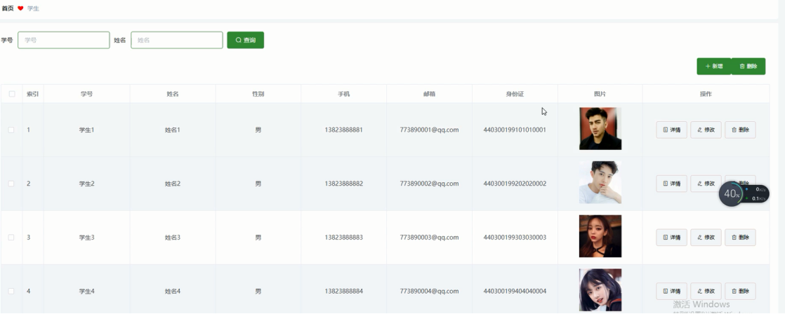

图5-9 教师管理界面图【管理员可增删改查教师信息，教师管理界面展示如图】
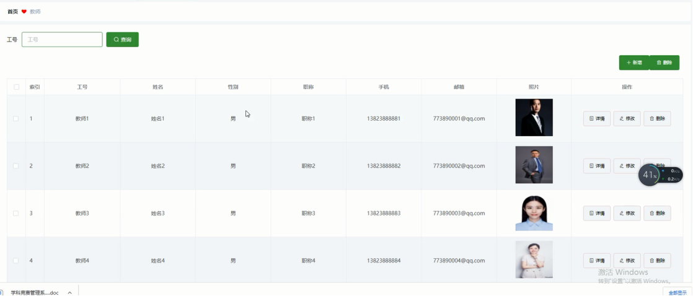

图5-10  赛项信息管理界面图【管理员可增删改查赛项信息，赛项信息管理界面如图】
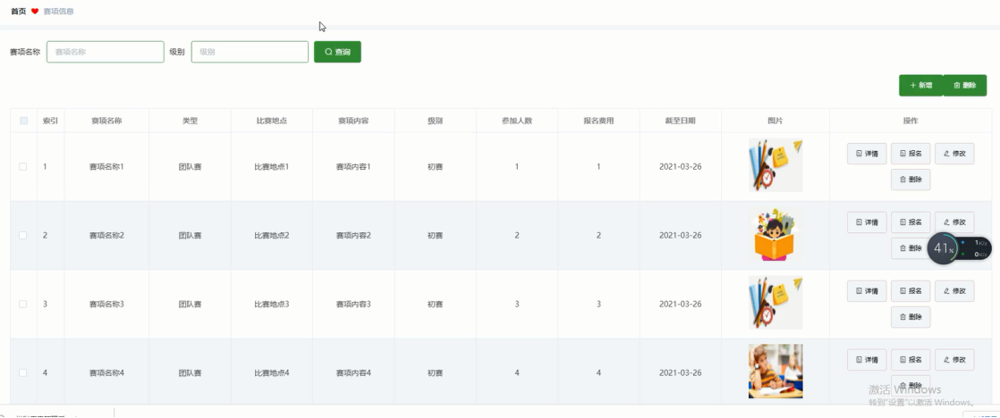

 <b>完整文章</b>
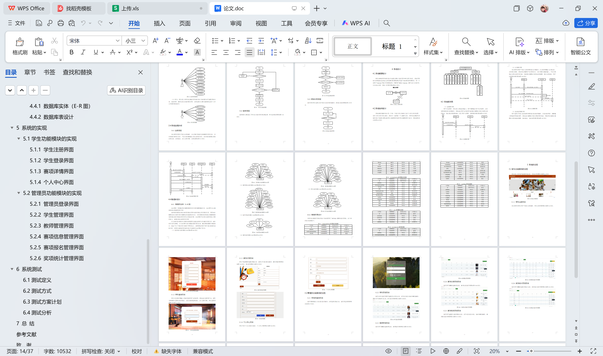

 

## 3000套系统可挑选，获取链接：https://chaerspol.github.io/

<b>QQ【获取完整源码】：674456564</b>

<b>QQ群【获取完整源码】：1058861570</b>

